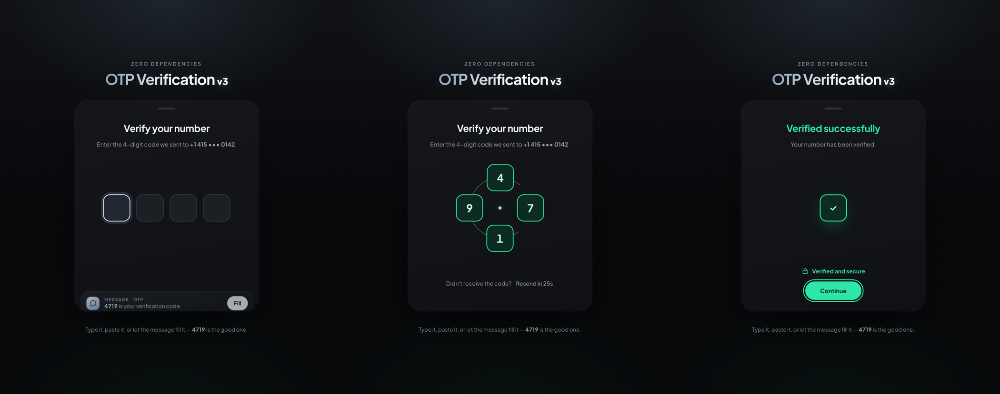

# OTP Verification v3

A four-digit one-time-code field where the payoff isn't a tick that *replaces* the boxes — it's the boxes **becoming** one.

Type the fourth digit and the row curls onto an orbit, spins a turn and a quarter as a single rigid ring, brakes so every digit lands back upright, then screws down into one verified tile.

**Zero dependencies. No build step. Transform and opacity only.**



### [→ Live demo](https://hasib41.github.io/otp-verification-v3/)

The code is `4719`. Type it, paste it, or let the message chip fill it. Anything else gets refused.

---

## How the motion works

Three beats, and the row's layout box never moves through any of them.

**1 · The curl.** The four wrap clockwise onto a circle — the outer two pulling in to the sides, the inner two swinging out to the top and bottom. Each one travels in **polar co-ordinates**: angle and radius are interpolated separately and only turned into x/y at the end, which is what bends the path into an arc. Interpolating position directly would draw a straight line between the same two points, and a straight line to a circle gives the whole thing away.

**2 · The spin.** A turn and a quarter, one direction, never reversing.

This is the part worth stealing. **Don't sample a sustained rotation into keyframes.** Keyframes interpolate a `translate` *linearly*, so a sampled orbit cuts straight chords across its own arc — and with the angle eased, mid-spin steps ran near 100°, where the chord sag is enormous. Measured on the first attempt: the radius collapsed by 16px, about twenty times a second. It read as a shake.

A revolution about a point is a native transform. Move each box's `transform-origin` to the hub and a plain `rotate()` sweeps it round an exact circle:

```js
slot.style.transformOrigin = `${hubX}px ${hubY}px`;

slot.animate([
  { transform: `rotate(0deg)   translate(${dx}px, ${dy}px)` },
  { transform: `rotate(450deg) translate(${dx}px, ${dy}px)` },
], { duration: 800, easing: 'cubic-bezier(.62,0,.38,1)' });
```

Two keyframes, drawn by the browser. Measured after the change: the radius holds to **0.14px**, down from 20.2px.

At 0° that transform is a pure translation — and a pure translation is origin-independent — so the origin can be swapped in on the frame the curl lands without moving anything by a pixel.

**Why a turn and a *quarter*?** 90° is a symmetry of a four-point ring, so the four land back on exactly the same four marks. A rounded square turned 90° is the same rounded square. The only thing the quarter disturbs is the digits, so the digit layer unwinds 90° over the brake — *slower* than the box it sits in, never against it. Nothing in the whole move ever reverses direction.

**3 · The screw down.** Still turning about the hub, the box is scaled to `s` and its translate retargeted to `-s·v0`. Work the composite through and the box's own offset cancels completely: the centre travels straight from the ring to the hub while the rotation keeps running — which is a spiral. Again exact, again two keyframes.

## Colour is reserved for verdicts

Attention has no hue. The box you're in, the charge running its border and the four on the track are simply **light** — a cold blue-white, brighter than the type around it, carrying a faintly blue glow (a pure white halo on black reads as fog; a blue one reads as a source).

Mint is the outcome and red is the refusal, and they're the only two hues the component ever puts on screen. That's what makes them impossible to miss when they arrive.

Colour never carries meaning alone: focus also lifts the box surface and adds a halo, where the error fills all four boxes — and every state changes the copy and the live region too.

## It's a real field, not a demo

- Four real `<input>`s with `autocomplete="one-time-code"` and `inputmode="numeric"`
- Paste or OS autofill the whole code into **any** box
- Arrow keys, Home/End, backspace that walks backwards, click-to-jump to the next empty box
- Web OTP API on supported devices (the mock message chip never appears there)
- Resend with a cooldown, an `aria-live` region for every outcome, `aria-invalid` on refusal
- `prefers-reduced-motion` skips the whole gyre and still lands every state
- With JavaScript off it degrades to a plain, usable four-box form
- Keystroke foley is dry, unpitched noise in the 3–6 kHz band — typing is foley, never a tune

The whole component is a state machine with one source of truth: `data-state` on `.sheet` (`idle → filling → checking → ok`, or `→ error → filling`). Every colour, glow, shake and copy swap is a selector on that attribute, so the visual layer can't drift out of sync with the logic.

## Run it

No toolchain, no install. Any static server:

```bash
python3 -m http.server 8000
# → http://localhost:8000
```

Opening `index.html` straight off the filesystem works too, though `file://` blocks the Web OTP API.

## Files

| | |
|---|---|
| `index.html` | markup — one form, five states |
| `app.css` | tokens, the state machine's entire visual layer |
| `app.js` | the field, and the polar/origin maths for the gyre |

## Licence

MIT — see [LICENSE](LICENSE).
